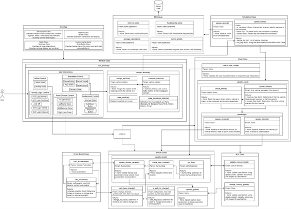

# Motorway Traffic Simulator with AI-Controlled Convoys
A microscopic traffic simulator using Pygame that is build on the Intelligent Driver Model [[1](#reference)] and Minimizing Overall Braking Induced by Lane change (MOBIL) model [[2](#reference)]

There are 2 types of vehicles simulated, a AI-Controlled Convoy (ACC) and a Simulated Human Controlled (SHC) vehicle. The ACC  models a 3-vehicle light goods vehicle convoy that drives on the left lane by default.

A 16km motorway was created with a 140m on-ramp placed at the 2050m mark of the motorway.

A similar [open-source traffic simulator](https://www.traffic-simulation.de/onramp.html) is created by Martin Treiber, which was used as a source of inspiration for this Pygame simulator.

## Requirements
To use this simulator, the packages listed in `requirements.txt` is used by executing the following command in the Windows CMD or Anaconda terminal of your chosen environment. Python 3.11.4 was used in this project.

```pip install -r requirements.txt```

## Using the Simulator
The basic simulation can be executed by running the `main.py` file. The default start-up paramters used are stored in the `common/config.py` file, where you can change it to play around with the different paramters.

The default changable parameters are the:
1. Preset Driving Logic of ACC or SHC Vehicles
2. Road Closure Locations: Off, Left, Middle, Right
3. Vehicle Inflow of range 1000 - 7000 vehicles/h
4. On-ramp Inflow of range 0 - 200 vehicles/h

The playback speed slider controls the simulation speed. Do note that the extend of playback speed is dependent on your computer's hardware capabilities. The default Frames Per Second (FPS) is set to 70FPS as it was the limit for the development laptop.

To pan the camera through the background, use the following controls:
- `Left` keyboard button to pan **left**
- `Down` keyboard button to pan **left** at a greater speed
- `Right` keyboard to pan **right**
- `Up` keyboard button to pan **right** at a greater speed

Otherwise, the mini-map slider thumb can be used to scroll through the motorway by clicking on the slider thumb and dragging it to the area of interest.

The top right hand corner of the interface allows `Pause`, `Unpause`, `Record` and `Restart` simulation functions.

To quit the simulation, press the `q` keyboard button.

## General Module Overview
The simulator is made up of various modules in mainly in the `src` folder that comprise of:
1. `ACC.py`
2. `DriverModel.py`
3. `Road.py`
4. `Simulation.py`
5. `Test.py`
6. `Vehicle.py`
7. `Visual.py`
8. `Window.py`
9. `Metrics.py` (in the main folder)

The interactions of these modules can be visualised in the figure below.


A brief description of the various modules are as follows:

### ACC Class
A class instance to represent ACC, creates a Convoy instance with 3 Vehicle instances.

### Vehicle Class
Create a Vehicle instance that will be used as a basis for SHC vehicles and individual ACC sub-convoy vehicles.

### DriverModel Class
Creating the DriverModel specific to the created vehicle based on the Intelligent Driver Model and the MOBIL lane change model.

### Road Class
Creates a road instance that managers all vehicles on the motorway. Host the vehicles spawned into the motorway.

### Test.py
A file used during experimental testing of the different road and driving conditions. These combinations are shown in `main.py`.

### Visual.py
A file to contain all the Class used in `Window.py` to produce a workable and intuitive user interface.

### Window.py
Imports visual classes from `Visual.py` and mainly handles user interactions and maintaining visualisation updates of the Pygame simulator.

### Simulation.py
This class links the Window class to the Road class via `update_frame`. Handles the saving of data if the `Record` button was pressed

### Metrics.py
A file to contain data visualisation of the recorded data from `Test.py`

## Reference
[1] M. Treiber, A. Hennecke, and D. Helbing, "Congested traffic states in empirical observations and microscopic simulations," Physical review E, vol. 62, no. 2, pp. 1805-1852, 2000, doi: https://doi.org/10.1103/PhysRevE.62.1805. \
[2] A. Kesting, M. Treiber, and D. Helbing, "General lane-changing model MOBIL for car-following models," Transportation Research Record, vol. 1999, no. 1, pp. 86-94, 2007, doi: https://doi.org/10.3141/1999-10.